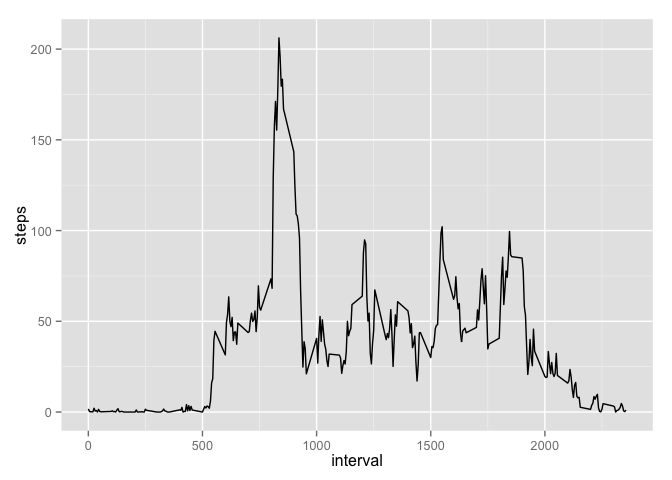
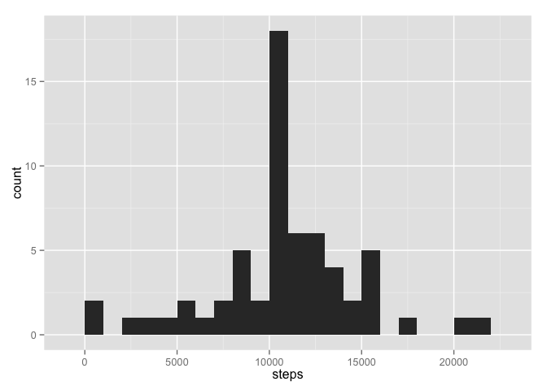
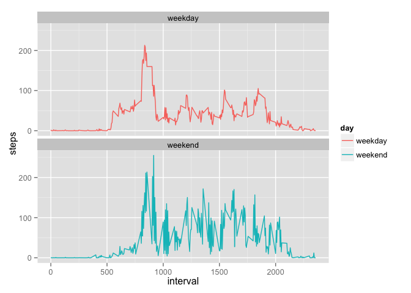

# Reproducible Research: Peer Assessment 1
Kate Stohr  
April 15, 2015  

## Loading and preprocessing the data

Checks that the necessary packages are loaded. 


```r
packages <- c("downloader", "ggplot2", "dplyr", "lubridate")
sapply(packages, require, character.only = TRUE, quietly = TRUE)
```

Sets the working directory. 


```r
setwd("~/Documents/Coursera/Reproducible Research/RepData_PeerAssessment1")
```
  
Unzips and loads the data 

```r
unzip("activity.zip")
activity <- read.csv("activity.csv")
```

## What is mean total number of steps taken per day?

1. Make a histogram of the total number of steps taken each day

```r
total.steps<-aggregate(steps ~ date, data = activity, sum)
plot1<-ggplot(data=total.steps, aes(x=steps))+geom_histogram(binwidth=1000)
print(plot1)
```

 

2. Calculate and report the **mean** and **median** total number of steps taken per day


```r
mean.steps<-mean(total.steps$steps)
median.steps<-median(total.steps$steps)
```


**The *mean* total number of steps taken per day is 10766.19 steps.**  

**The *median* total number of steps taken per day is 10765 steps.**

## What is the average daily activity pattern?

1. Make a time series plot (i.e. `type = "l"`) of the 5-minute interval (x-axis) and the average number of steps taken, averaged across all days (y-axis)


```r
steps.interval <- aggregate(steps~interval, data=activity, mean, na.rm=TRUE)
plot2<-ggplot(data=steps.interval, aes(x=interval, y=steps))+geom_line(stat = "identity") 
print(plot2)
```

 

2. Which 5-minute interval, on average across all the days in the dataset, contains the maximum number of steps?


```r
max.interval<-steps.interval[which.max(steps.interval$steps),]$interval
```

**The interval that has the most steps on average across all the days is interval 835.**

## Imputing missing values

Note that there are a number of days/intervals where there are missing values(coded as `NA`). The presence of missing days may introduce bias into some calculations or summaries of the data.

1. Calculate and report the total number of missing values in the dataset (i.e. the total number of rows with `NA`s)


```r
sum(!complete.cases(activity))
```

```
## [1] 2304
```

2. Devise a strategy for filling in all of the missing values in the dataset. The strategy does not need to be sophisticated. For example, you could use the mean/median for that day, or the mean for that 5-minute interval, etc.

**I decided to fill in missing values with the mean for the 5-minute interval.** 


3. Create a new dataset that is equal to the original dataset but with the missing data filled in.


```r
activity2 <- merge(activity, steps.interval, by="interval", suffixes=c("",".mean"))
nas<-is.na(activity2$steps)
activity2$steps[nas]<-activity2$steps.mean[nas]
activity2<- activity2 %>% 
        select(steps, date, interval) %>% 
        arrange(date, interval)
```

4. Make a histogram of the total number of steps taken each day and Calculate and report the **mean** and **median** total number of steps taken per day. 


```r
total.steps<-aggregate(steps ~ date, data = activity2, sum)
plot3<-ggplot(data=total.steps, aes(x=steps))+geom_histogram(binwidth=1000)
print(plot3)
```

 

Recalculate the mean and median steps per day:

```r
mean.steps<-mean(total.steps$steps)
median.steps<-median(total.steps$steps)
```

**The *mean* total number of steps taken per day is 10766.19 steps.**  

**The *median* total number of steps taken per day is 10766.19 steps.**
    
Do these values differ from the estimates from the first part of the assignment? 

**Yes, they are different.**

What is the impact of imputing missing data on the estimates of the total daily number of steps?

**The value of the median total number steps per day is slightly different and reflects the mean now that we have replaced missing values with the mean for each interval.**

## Are there differences in activity patterns between weekdays and weekends?

1. Create a new factor variable in the dataset with two levels – “weekday” and “weekend” indicating whether a given date is a weekday or weekend day.


```r
activity2$day<-weekdays(ymd(activity2$date))
weekend<-c("Sunday", "Saturday")
activity2$day<-ifelse (activity2$day==weekend, yes="weekend", no="weekday")
activity2$day<-as.factor(activity2$day)
```

2. Make a panel plot <-containing a time series plot (i.e. type = "l") of the 5-minute interval (x-axis) and the average number of steps taken, averaged across all weekday days or weekend days (y-axis).  

First, find the average number of steps taken by interval


```r
steps.interval2 <- aggregate(steps~interval+day, data=activity2, mean, na.rm=TRUE)
```

Then create a panel plot: 


```r
plot4<-ggplot(data=steps.interval2, aes(x=interval, y=steps, group=day, color=day)) + geom_line(stat = "identity") + facet_wrap(~day, ncol=1)
print(plot4)
```

 

**Activity seems to start later in the day and end later in the day on weekends. There also appears to be higher spikes of activity throughout the day on weekends.**  
